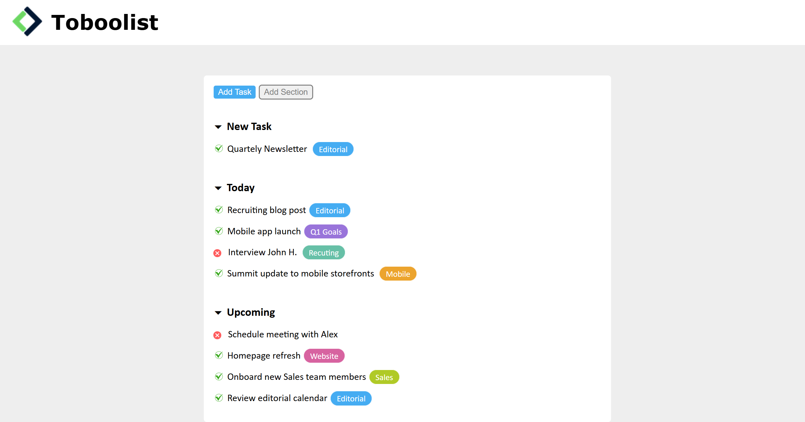

<h1 align="center">Toboolist</h1>

###

  
  
  
  
  

###

###

Esercizio Ricreiamo una TodoList seguendo il layout in allegato.   Consigli Partiamo sempre dal definire le macroaree del layout e analizziamo poi gli elementi in comune nelle diverse aree e quindi tutto ciò che possiamo centralizzare, per rendere il codice meno ripetitivo e quindi più mantenibile.  Consegna Pushate in Github utilizzando VS code e stando attenti, quando create la repo, di rispettare il nome della repo, in questo caso html-css-toboolist.

###

